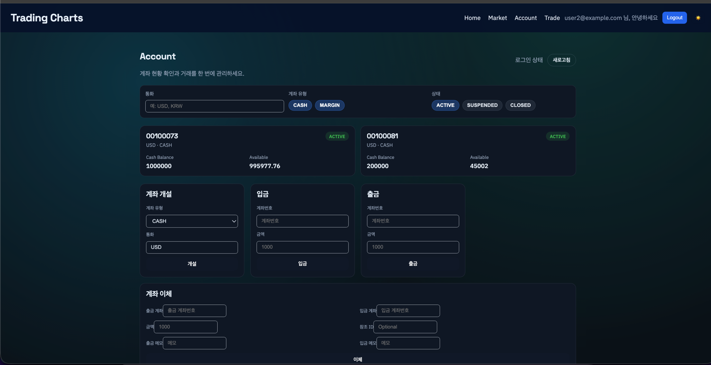
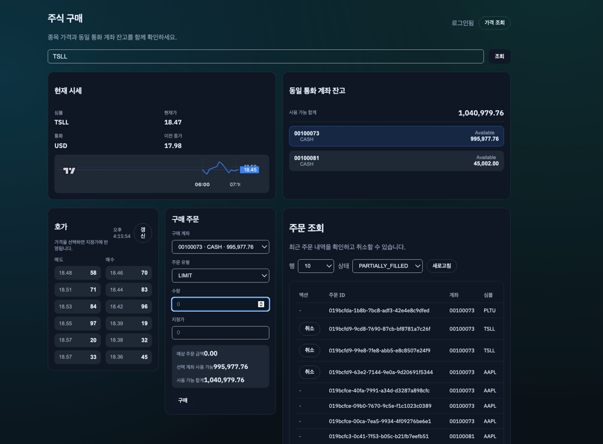

# 증권사 + 은행 서버를 만들어보았다.
## trading-mono


### 생각중
---
- API GATEWAY + MSA로 먼저 할려고 하니 머리가 아파서
- 모놀리식으로 주식 조회 사이트 개발
- 나중에 API GATEWAY + MSA로 떼어낼수 있게 코드 작성한다.
- 환전을 또 만들까? 손이 많이 가는데.. ㅠ_ㅠ
- AWS 배포 미리 작업 해두자!!

### TODOS
---
- [x] USER 생성
- [x] JWT 인증
- [x] 주가 조회
- ACCOUNT 설계는 DBS 참고해서 작성해보자.
- https://www.dbs.com/dbsdevelopers/discover/index.html
- - [x] ACCOUNT 도메인 추가
- - [x] ACCOUNT 입/출금 내역 도메인 추가
- - [x] ACCOUNT 생성 Service / RestAPI
- - [x] ACCOUNT 조회 Service / RestAPI
- - [x] ACCOUNT 입금 Service / RestAPI
- - [x] ACCOUNT 출금 Service / RestAPI
- - [x] ACCOUNT 이체 Service / RestAPI
- 주식 구매(Trade)
- - [X] Order 도메인 추가
- - [X] OrderFill(주문 체결) 도메인 추가 
- - [ ] Position 도메인 추가
- - [ ] Trade 도메인 추가
- - [X] Order 생성 Service / RestAPI


### local 실행
---

API SERVER 실행
```
# yfinanace-server Proxy 서버 실행
docker compose -f ./docker/yfinanace-server/docker-compose.yml up -d 
# mariadb / redis 실행
docker compose -f ./docker-compose.yml up -d
/gradlew api-server:bootRun
```

UI 실행
```
cd web-ui && npm install && npm run dev
```


# 작업 진행중 UI 






# 관련 인프라 실행
```
# yfinanace-server Proxy 서버 실행(주가 조회 프록시 서버)
docker compose -f ./docker/yfinanace-server/docker-compose.yml up -d
# mariadb / redis 실행 
docker compose -f ./docker-compose.yml up -d 
```


### 잡담
---

## Projections.constructor
개인적으로는 실수하기 수위서 사용하고 싶지 않은데
record를 사용하면 결국은 생성자 기반이라서...
Projection 추가될때 순서때문에 분명히 실수 할 소지가 많을건데...
그렇다고 field사용하면 너무 너무 느리고,
class / setter 사용하면 경기를 일으키고
트랜드가 참 머같다.
